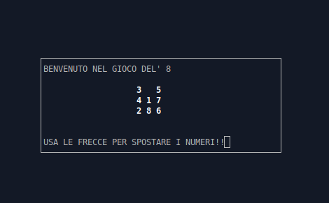

# game of 8 
It's a simple game write in C using ncurses library.





## Requirements

### Installing ncurses library
Debian\Ubuntu
```bash
 sudo apt-get install libncurses5-dev libncursesw5-dev
 ```
 
 Fedora
 ```bash
  sudo dnf install ncurses-devel
 ```

## Run Game
Download main directory and open the terminal
```bash
gcc main.c fun.c -lncurses
./a.out
```
